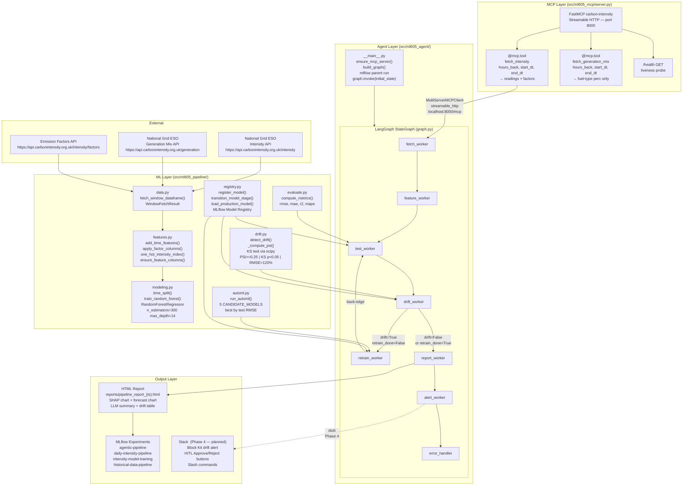

# ARCHITECTURE.md — ml605 Agentic MLOps Pipeline

Three diagrams describe the system from three perspectives: how the major layers relate, how data moves through node state, and how raw API responses become model predictions.

---

## Diagram 1 — System Layers

This diagram shows the five logical layers. The MCP layer decouples agent code from the raw API — workers call `fetch_intensity` via `MultiServerMCPClient` rather than calling `data.py` directly, so the MCP server can be replaced or mocked independently. All workers log to nested MLflow runs under a single parent run started in `__main__.py`. The Slack layer (`alert_worker`) is currently a stub that returns `alert_sent=False`; Phase 4 will replace it with real Block Kit posting.

---

## Diagram 2 — LangGraph State Machine

```mermaid
flowchart LR
    START(["START"])

    subgraph FW_BOX["fetch_worker"]
        FW_IN["READS:\nwindow_hours\nmlflow_run_id"]
        FW_OUT["WRITES:\ndf\nfactors\nrows_fetched\n— or —\nstatus=error\nerror"]
    end

    subgraph FEATW_BOX["feature_worker"]
        FEATW_IN["READS:\ndf\nfactors\nmlflow_run_id"]
        FEATW_OUT["WRITES:\ndf_featured\nfeature_cols\n— or —\nstatus=error\nerror"]
    end

    subgraph TW_BOX["test_worker"]
        TW_IN["READS:\ndf_featured\nfeature_cols\nmlflow_run_id"]
        TW_OUT["WRITES:\neval_result\n— or —\nstatus=error\nerror"]
    end

    subgraph DW_BOX["drift_worker"]
        DW_IN["READS:\nfeature_cols\nfactors\ndf_featured\neval_result\nmlflow_run_id"]
        DW_OUT["WRITES:\ndrift_report\noverall_drift\nrmse_degradation_pct\nrmse_degradation_fired\nproduction_rmse\n— or —\nstatus=error\nerror"]
    end

    subgraph RW_BOX["retrain_worker"]
        RW_IN["READS:\ndf_featured\nfeature_cols\nmlflow_run_id"]
        RW_OUT["WRITES:\nnew_model_version\nretrain_done=True\n— or —\nstatus=error\nerror"]
    end

    subgraph RPW_BOX["report_worker"]
        RPW_IN["READS:\ndf_featured\nfeature_cols\neval_result\ndrift_report\noverall_drift\nrmse_degradation_pct\nnew_model_version\nretrain_done\nmlflow_run_id\nstatus"]
        RPW_OUT["WRITES:\nreport_path\nshap_top_features\n— or —\nstatus=error\nerror"]
    end

    subgraph AW_BOX["alert_worker  (stub)"]
        AW_IN["READS:\nmlflow_run_id"]
        AW_OUT["WRITES:\nalert_sent=False"]
    end

    subgraph HITL_BOX["hitl_decision_node\n(Phase 4 — planned)"]
        HITL_IN["READS:\noverall_drift\nshap_top_features\nreport_path"]
        HITL_OUT["WRITES:\nhitl_decision\napproved or rejected"]
    end

    subgraph EH_BOX["error_handler"]
        EH_IN["READS:\nmlflow_run_id\nerror"]
        EH_OUT["WRITES:\nstatus=error"]
    end

    END_NODE(["END"])

    START --> FW_BOX
    FW_BOX -- "route_after_fetch\nstatus!=error" --> FEATW_BOX
    FW_BOX -- "status=error" --> EH_BOX
    FEATW_BOX -- "route_after_feature\nstatus!=error" --> TW_BOX
    FEATW_BOX -- "status=error" --> EH_BOX
    TW_BOX -- "route_after_test\nstatus!=error" --> DW_BOX
    TW_BOX -- "status=error" --> EH_BOX
    DW_BOX -- "route_after_drift\ndrift=False or retrain_done=True" --> RPW_BOX
    DW_BOX -- "drift=True\nretrain_done=False" --> RW_BOX
    DW_BOX -- "status=error" --> EH_BOX
    RW_BOX -- "route_after_retrain\nback-edge" --> TW_BOX
    RW_BOX -- "status=error" --> EH_BOX
    RPW_BOX -- "edge" --> AW_BOX
    AW_BOX -- "edge" --> END_NODE
    EH_BOX -- "edge" --> END_NODE
    DW_BOX -. "Phase 4:\ninserted before retrain" .-> HITL_BOX
    HITL_BOX -. "approved" .-> RW_BOX
    HITL_BOX -. "rejected" .-> RPW_BOX
```

This diagram shows exactly which `PipelineState` keys each node reads and writes, making it possible to understand data dependencies without opening a source file. Workers return **partial dicts** (only their owned keys) because `PipelineState` uses `TypedDict, total=False` — LangGraph merges the returned dict into the running state. The `retrain_done=True` guard written by `retrain_worker` prevents the back-edge loop (`retrain → test → drift → retrain`) from cycling infinitely: `route_after_drift` routes to `report_worker` once `retrain_done` is True. The Phase 4 `hitl_decision_node` (dashed) will use LangGraph `interrupt()` to pause graph execution between drift detection and retraining, waiting for a human Slack response before proceeding.

---

## Diagram 3 — Data Flow

```mermaid
flowchart LR
    A["National Grid ESO\nAPI JSON\n/intensity/{from}/{to}\n/generation/{from}/{to}\n/intensity/factors"]

    B["WindowFetchResult\ndf: DataFrame\nfactors: dict str->float\nraw_factors_json: str"]

    C["Raw DataFrame\ntimestamp, interval_end\nactual_intensity, forecast_intensity\nintensity_index\ngas, wind, nuclear, coal,\nbiomass, imports, other,\nhydro, solar  (perc %)"]

    D["+Time Features\nhour, day_of_week, month\nday_of_year, is_weekend"]

    E["+Factor Columns\nfactor_gas_combined_cycle\nfactor_wind, factor_nuclear\nfactor_coal, ...  (constant per row)"]

    F["+One-Hot Intensity\nintensity_index_very_low\nintensity_index_low\nintensity_index_moderate\nintensity_index_high\nintensity_index_very_high"]

    G["Aligned Feature Matrix\nonly columns in features_used.txt\nmissing columns filled with 0.0"]

    H["RandomForestRegressor\nn_estimators=300\nmax_depth=14\nfit on historical_data.csv\npredict on current window"]

    I["Predictions\ny_pred: np.ndarray\nvs y_true: actual_intensity"]

    J["Drift Signals\nPSI per feature\n_compute_psi reference vs current\nKS test ks_2samp\nRMSE degradation\ncurrent_rmse / production_rmse"]

    K["Drift Verdict\noverall_drift: bool\nPSI>=0.25 OR KS_p<0.05 OR\ncurrent_rmse > production_rmse*1.20"]

    L["SHAP Values\nshap.Explainer model\nExplanation object\nmean abs per feature\ntop_features list"]

    M["HTML Report\nreports/pipeline_report_{ts}.html\nmetrics table + forecast chart\nSHAP bar chart + drift table\nGroq LLM 2-3 paragraph summary\nlogged to MLflow artifacts"]

    A -- "fetch_window_dataframe()\n_get_json() retries=3\nmerge on from timestamp" --> B
    B -- "pd.DataFrame(rows)\ndropna timestamp\nsort ascending" --> C
    C -- "add_time_features()\nfeatures.py" --> D
    D -- "apply_factor_columns()\nnormalize_factor_name()\nfeatures.py" --> E
    E -- "one_hot_intensity_index()\npd.CategoricalDtype\npd.get_dummies prefix=intensity_index\nfeatures.py" --> F
    F -- "ensure_feature_columns()\nload_feature_list features_used.txt\nfill missing cols with 0.0\nfeatures.py" --> G
    G -- "model.predict(X)\ntest_worker\nworkers.py" --> H
    H --> I
    I -- "compute_metrics()\nevaluate.py\nrmse mae r2 mape" --> J
    G -- "detect_drift()\ndrift.py" --> J
    J -- "drift_worker\nworkers.py\noverall_drift = PSI_OR_KS OR rmse_deg" --> K
    K -- "K=True → retrain_worker\nrun_automl() automl.py\nregister_model() registry.py\nStaging promotion" --> H
    G -- "_compute_shap()\nshap.Explainer\ngraph.py" --> L
    L -- "report_worker\n_shap_bar_to_base64()\n_forecast_chart_to_base64()\n_generate_llm_summary()\n_render_report() Jinja2\ngraph.py" --> M
    I --> M
    K --> M
```

This diagram traces a single observation from raw API bytes to the final HTML report artifact. The transformation chain in `features.py` is designed for composability — each function takes a DataFrame and returns a new DataFrame, making it safe to apply subsets of the pipeline in tests without side effects. The `ensure_feature_columns` step at the end of the chain is the key inference-alignment mechanism: it guarantees the feature matrix always has exactly the columns the model was trained on, regardless of which categories appear in the current window. The retrain loop (dashed back-edge from drift verdict to `RandomForestRegressor`) uses the same feature matrix `G` and replaces the Production model in MLflow registry, after which the graph re-evaluates with `test_worker` to confirm the new model's metrics before generating the report.
