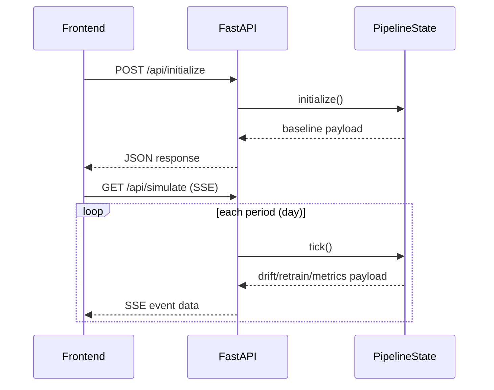
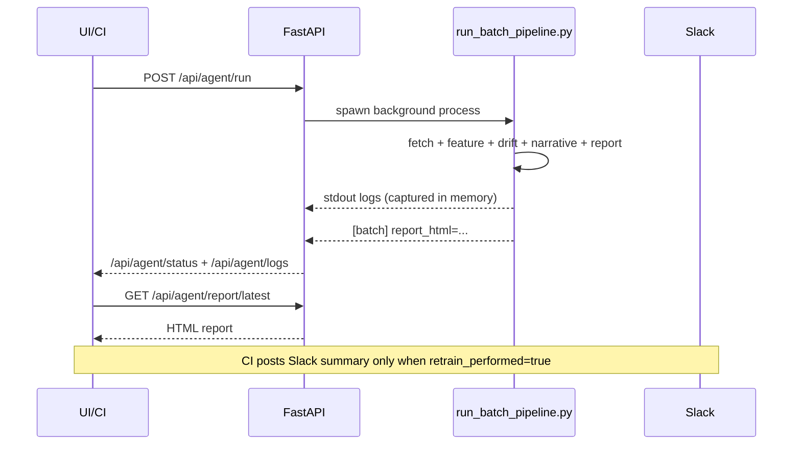

# MSML605 - CarbonWatch MLOps Demo

End-to-end MLOps demo for carbon intensity monitoring, drift detection, retrain signaling, and automated reporting.

This repository contains:
- A FastAPI backend for simulation and agent orchestration
- A frontend dashboard for drift/retrain visualization
- A batch "agent" pipeline that generates HTML drift reports
- CI/CD workflows for deploy, smoke tests, rollback protection, and Slack notifications

---

## Table of Contents
- [Overview](#overview)
- [Architecture](#architecture)
- [Repository Structure](#repository-structure)
- [Runtime and Dependencies](#runtime-and-dependencies)
- [Environment Variables](#environment-variables)
- [Run Locally](#run-locally)
- [API Endpoints](#api-endpoints)
- [Frontend Behavior](#frontend-behavior)
- [Agent Reporting and Narrative](#agent-reporting-and-narrative)
- [Testing](#testing)
- [Deployment and CI/CD](#deployment-and-cicd)
- [Troubleshooting](#troubleshooting)
- [Security and Operations Notes](#security-and-operations-notes)

---

## Overview

The system has two primary execution paths:

1. **Interactive Simulation Path**  
   Users initialize a baseline model and run drift simulation via streaming API (`/api/simulate`).  
   The UI shows:
   - PCA projection
   - KDE distribution shift
   - KS/PSI history over time
   - retrain trigger points and model version changes

2. **Agent Batch Path**  
   A background job (`run_batch_pipeline.py`) fetches a live data window, computes drift metrics, generates an HTML report, and logs narrative output (Groq or fallback).  
   This path is exposed through `/api/agent/*` endpoints and can be triggered from UI or CI.

---

## Architecture

### High-level System Diagram

```mermaid
flowchart LR
  U[User] --> FE[Frontend Dashboard]
  FE -->|HTTP/SSE| API[FastAPI Backend main.py]

  API -->|simulate| SIM[pipeline.py]
  API -->|background thread| AGENT[run_batch_pipeline.py]

  AGENT --> CFG[src/ml605_pipeline/config.py]
  AGENT --> DATA[src/ml605_pipeline/data.py]
  AGENT --> FEAT[src/ml605_pipeline/features.py]
  AGENT --> DRIFT[src/ml605_pipeline/drift.py + drift_service.py]
  AGENT --> REP[data/reports/*.html]

  API -->|serve latest| REPORT[/api/agent/report/latest]

  AGENT --> GROQ[Groq API optional]
  CI[GitHub Actions] -->|post-deploy trigger| API
  CI -->|Slack webhook| SLACK[Slack Channel]
```

### Interactive Simulation Flow



### Agent Reporting Flow



---

## Repository Structure

Key files/directories:

- `main.py` - FastAPI app, simulation routes, agent routes, report serving
- `pipeline.py` - simulation engine (`PipelineState`)
- `run_batch_pipeline.py` - batch drift/report/narrative generation
- `frontend/index.html` - dashboard layout
- `frontend/app.js` - dashboard behavior + agent panel
- `src/ml605_pipeline/` - reusable data/features/drift/config modules
- `src/ml605_mcp/server.py` - optional MCP server (port `8001`)
- `.github/workflows/deploy.yml` - CI/CD workflow
- `Dockerfile` - production container spec
- `tests/test_pipeline.py` - pipeline unit tests
- `tests/test_api.py` - smoke/integration tests against live backend
- `.env.example` - environment variable template
- `data/windows/` - saved window CSV artifacts
- `data/reports/` - generated HTML reports

---

## Runtime and Dependencies

- Python: **3.11** (CI and Docker baseline)
- Backend stack:
  - `fastapi`, `uvicorn`
  - `pandas`, `numpy`, `scipy`, `scikit-learn`
  - `boto3` (CloudWatch monitoring path)
- Testing:
  - `pytest`, `pytest-cov`, `pytest-timeout`, `requests`

Install dependencies:

```bash
pip install -r requirements.txt
```

---

## Environment Variables

Use `.env.example` as baseline:

```bash
cp .env.example .env
```

### Core Runtime
- `PIPELINE_WINDOW_HOURS` (default `12`)
- `PIPELINE_INTERVAL_SECONDS` (default `30`)
- `PIPELINE_KS_THRESHOLD` (default `0.10`)
- `PIPELINE_PSI_THRESHOLD` (default `0.25`)
- `PROJECT_ROOT` (default `.`)
- `DATA_DIR` (default `data`)
- `WINDOWS_DIR` (default `data/windows`)
- `REPORTS_DIR` (default `data/reports`)
- `REFERENCE_DATA_PATH` (default `data/historical_data.csv`)
- `FEATURES_PATH` (default `features_used.txt`)

### Narrative Generation
- `GROQ_API_KEY` (optional but recommended)  
  If missing/unavailable, batch pipeline uses deterministic fallback narrative.

### Deployment/Monitoring
- `MCP_BASE_URL` (default `http://localhost:8001`)
- AWS vars for CloudWatch monitoring path (optional):
  - `AWS_REGION`
  - `AWS_ACCESS_KEY_ID`
  - `AWS_SECRET_ACCESS_KEY`
  - `APP_RUNNER_SERVICE_ARN`

### CI Secrets (GitHub repository secrets)
- `RENDER_DEPLOY_HOOK_URL`
- `RENDER_URL`
- `SLACK_WEBHOOK_URL`
- (optional for richer narrative from deployed backend) `GROQ_API_KEY` in Render env

---

## Run Locally

### 1) Install dependencies

```bash
pip install -r requirements.txt
```

### 2) Start backend API

```bash
uvicorn main:app --host 0.0.0.0 --port 8000 --reload
```

### 3) Start frontend (static)

```bash
python -m http.server 8080 --directory frontend
```

Open: `http://localhost:8080`

> Note: `frontend/app.js` currently points API to `https://msml605.onrender.com`.  
> For fully local backend testing from browser UI, update `const API` in `frontend/app.js` to `http://localhost:8000`.

### 4) (Optional) Start MCP server

```bash
python src/ml605_mcp/server.py
```

MCP health: `http://localhost:8001/health`

---

## API Endpoints

### Simulation endpoints
- `POST /api/initialize` - initialize model + return baseline payload
- `GET /api/simulate` - SSE stream of period-by-period simulation output
- `POST /api/pause` - pause simulation stream
- `POST /api/resume` - resume simulation stream
- `POST /api/reset` - reset simulation state
- `GET /api/status` - simulation status
- `POST /api/predict` - single prediction endpoint

### Agent endpoints
- `POST /api/agent/run` - start background batch agent
- `GET /api/agent/status` - status, report availability, metadata
- `GET /api/agent/logs` - captured stdout logs (in-memory)
- `GET /api/agent/report/latest` - serve latest generated HTML report

### Monitoring endpoints (optional AWS setup)
- `GET /api/cloudwatch/metrics`
- `GET /api/cloudwatch/stream` (SSE)

---

## Frontend Behavior

The dashboard includes:
- PCA projection with separate colors for:
  - model training data
  - new incoming data
- Distribution shift KDE panel
- Drift history chart:
  - KS line
  - PSI line
  - retrain trigger markers
  - threshold overlays
- Agent logs panel:
  - run, refresh, toggle logs
  - open latest report when available

Current defaults:
- KDE feature: `coal`
- KS threshold: `0.30`
- init samples: `1000`
- monthly samples: `1000`

---

## Agent Reporting and Narrative

`run_batch_pipeline.py`:
1. Fetches latest window data
2. Saves CSV in `data/windows/`
3. Computes PSI/KS drift diagnostics
4. Determines `retrain_performed` signal
5. Generates narrative:
   - Groq API if key is present
   - fallback summary otherwise
6. Writes HTML report to `data/reports/`
7. Emits machine-readable log markers consumed by API/CI

Important emitted markers:
- `[batch] overall_drift=...`
- `[batch] drift_score(max_psi)=...`
- `[batch] drifted_features=...`
- `[batch] retrain_performed=true|false`
- `[batch] narrative_json="..."`
- `[batch] report_html=/abs/path/...html`

---

## Testing

### Unit tests

```bash
pytest tests/test_pipeline.py -v
```

### API smoke tests (requires running backend)

Local:

```bash
BASE_URL=http://localhost:8000 pytest tests/test_api.py -v -k "not TestSimulate"
```

Render:

```bash
BASE_URL=https://msml605.onrender.com pytest tests/test_api.py -v -k "not TestSimulate"
```

---

## Deployment and CI/CD

Deployment workflow: `.github/workflows/deploy.yml` (branch `amey-demo`)

Pipeline stages:
1. Unit tests
2. Frontend deploy to GitHub Pages (`gh-pages`)
3. Backend deploy trigger to Render (webhook)
4. Post-deploy smoke tests
5. Failure Slack alert
6. Conditional auto-rollback (`git revert`) only when smoke tests fail
7. Post-deploy drift report Slack job:
   - triggers agent run on deployed backend
   - waits for completion
   - posts report summary + narrative to Slack **only if** `retrain_performed=true`
8. DORA metrics recording job

### Current deployed targets
- Backend API: `https://msml605.onrender.com`
- Frontend: published from `frontend/` to `gh-pages` branch (GitHub Pages)

---

## Troubleshooting

### Agent shows "unavailable"
- Ensure `run_batch_pipeline.py` is present in container image.
- Dockerfile must copy:
  - `run_batch_pipeline.py`
  - `features_used.txt`

### Batch pipeline crashes with missing features file
- Ensure `FEATURES_PATH` points to valid file.
- In Docker image, `features_used.txt` must exist at `/app/features_used.txt` (default).

### Report not available
- Run agent once (`/api/agent/run`) and wait for status `succeeded`.
- Check `/api/agent/logs` for `[batch] report_html=...`.

### Unexpected deploy reverts
- Verify rollback job guard in workflow:
  - rollback should run only when smoke tests result is failure.

### Frontend not talking to local backend
- Update `frontend/app.js`:
  - `const API = 'http://localhost:8000';`

### Groq narrative missing
- Confirm `GROQ_API_KEY` is set in Render environment.
- Fallback narrative is expected if key absent/invalid.

---

## Security and Operations Notes

- Do not commit secrets into repository.
- Use GitHub Secrets for CI and Render env vars for runtime secrets.
- Agent logs are currently stored in-memory in backend process (ephemeral).
- Generated report files are local filesystem artifacts; persistence depends on deployment storage behavior.

---

## Quick Start (TL;DR)

```bash
cp .env.example .env
pip install -r requirements.txt
uvicorn main:app --host 0.0.0.0 --port 8000 --reload
python -m http.server 8080 --directory frontend
```

Then open:
- `http://localhost:8080` (frontend)
- `http://localhost:8000/docs` (backend docs)

---

If you want, a follow-up can add:
- one-command local bootstrap script
- Makefile targets (`make run`, `make test`, `make smoke`)
- architecture diagram images generated from Mermaid for presentation use.
