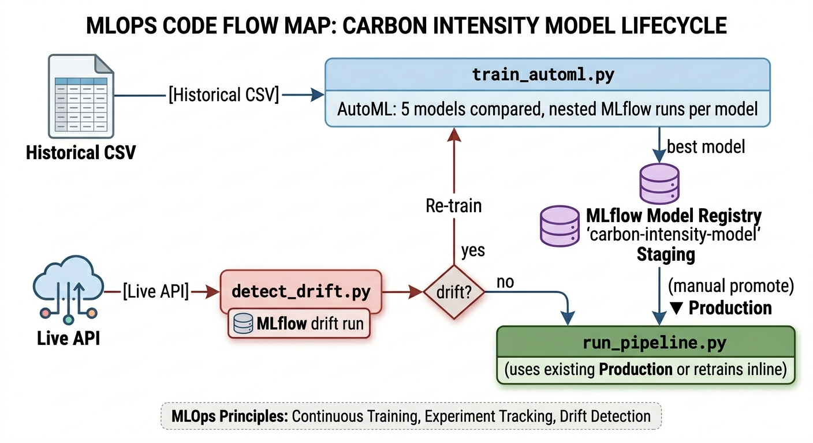

# ML605 — UK Carbon Intensity Prediction Pipeline

A production-grade machine learning pipeline that predicts UK electricity grid carbon intensity (gCO₂/kWh) using the [Carbon Intensity API](https://carbonintensity.org.uk/). The system features automated data drift detection, AutoML model selection, MLflow experiment tracking, and CI/CD via GitHub Actions.

---

## Architecture



The pipeline operates across two independent workflows:

| Workflow | Trigger | Purpose |
|---|---|---|
| **Historical batch** | Manual / one-time | Fetch 6 years of data, run AutoML, register best model |
| **Daily window** | Cron (08:00 + 20:00 UTC) | Drift check → retrain only if needed → promote to Production |

### Data flow (daily pipeline)

```
Carbon Intensity API
        │
        ▼
fetch_window_dataframe()           ← last N hours of intensity + generation mix
        │
        ├── add_time_features()    ← hour, day_of_week, month, day_of_year, is_weekend
        ├── apply_factor_columns() ← emission factors (constant per fuel type)
        └── one_hot_intensity_index() ← very low / low / moderate / high / very high
                │
                ▼
        detect_drift()             ← PSI + KS test vs. historical_data.csv
                │
        ┌───────┴────────┐
      drift?           no drift
        │                │
        ▼                ▼
   run_automl()     skip retrain
   (5 models)       [pipeline_outcome = skipped_no_drift]
        │
        ▼
   best model → register_model() → MLflow Model Registry → Production
```

### Drift decision logic

| Condition | Action |
|---|---|
| PSI < 0.10 | No change (green) |
| 0.10 ≤ PSI < 0.25 | Monitor (amber) — KS test used as tiebreaker |
| PSI ≥ 0.25 | Retrain (red) |
| KS p-value < 0.05 | Retrain (red) — regardless of PSI |

---

## Requirements

- Python ≥ 3.13
- [uv](https://github.com/astral-sh/uv) — fast Python package manager

---

## Setup

**1. Clone the repository**

```bash
git clone https://github.com/AmeyHengle/MSML605.git
cd MSML605
git checkout chaitanya
```

**2. Install dependencies**

```bash
uv sync
```

Creates `.venv` and installs all locked dependencies (scikit-learn, mlflow, pandas, scipy) from `uv.lock`.

---

## Workflows

### Workflow A — Historical Batch *(one-time bootstrap)*

Run this once to fetch training data and register an initial Production model.

**Step 1 — Fetch 6 years of historical data**

```bash
uv run python fetch_historical_data.py
```

Writes `historical_data.csv` and `intensity_factors.json`. Logs to MLflow under `historical-data-pipeline`.

**Step 2 — Run AutoML on historical data**

```bash
uv run python train_automl.py
```

Compares 5 models (RandomForest, GradientBoosting, Ridge, Lasso, ExtraTrees) via nested MLflow runs under `intensity-model-automl`. Registers the winner to MLflow Model Registry as `carbon-intensity-model` in Staging.

**Step 3 — Promote to Production** *(manual, one-time)*

```bash
uv run python -c "
from ml605_pipeline.registry import transition_model_stage
transition_model_stage('1', 'Production')
"
```

Or promote via the MLflow UI at [http://localhost:5000](http://localhost:5000).

---

### Workflow B — Daily Pipeline

Runs automatically via GitHub Actions. To run manually:

```bash
uv run python run_pipeline.py
```

**Environment variable overrides:**

```bash
# Linux / macOS
PIPELINE_WINDOW_HOURS=24 PIPELINE_INTERVAL_SECONDS=1800 uv run python run_pipeline.py

# Windows (PowerShell)
$env:PIPELINE_WINDOW_HOURS="24"
$env:PIPELINE_INTERVAL_SECONDS="1800"
uv run python run_pipeline.py
```

| Variable | Default | Description |
|---|---|---|
| `PIPELINE_WINDOW_HOURS` | `12` | Hours of live data to fetch |
| `PIPELINE_INTERVAL_SECONDS` | `1800` | Half-hourly interval (30 min) |
| `MLFLOW_EXPERIMENT` | `daily-intensity-pipeline` | MLflow experiment name |
| `MLFLOW_TRACKING_URI` | local `./mlruns` | Remote MLflow server URI |

---

### Standalone Drift Check

Check for drift without triggering retraining:

```bash
uv run python detect_drift.py
```

Exits `0` (no drift) or `1` (drift detected). Logs a full per-feature drift report to MLflow under `carbon-intensity-drift`.

---

### Baseline Model *(single RandomForest)*

Quick single-model training run without AutoML:

```bash
uv run python train_with_mlflow.py
```

Logs to `intensity-model-training`.

---

## MLflow UI

```bash
uv run mlflow ui --port 5000
```

Open [http://localhost:5000](http://localhost:5000) to browse experiments, compare runs, and manage the Model Registry.

### Experiments

| Experiment | Populated by |
|---|---|
| `historical-data-pipeline` | `fetch_historical_data.py` |
| `intensity-model-training` | `train_with_mlflow.py` |
| `intensity-model-automl` | `train_automl.py` |
| `daily-intensity-pipeline` | `run_pipeline.py` |
| `carbon-intensity-drift` | `detect_drift.py` |

---

## Source Package (`src/ml605_pipeline/`)

| Module | Responsibility |
|---|---|
| `config.py` | `PipelineConfig` dataclass + `load_config_from_env()` |
| `data.py` | `fetch_window_dataframe()` — API fetch with retry logic |
| `features.py` | `add_time_features`, `one_hot_intensity_index`, `apply_factor_columns`, `ensure_feature_columns` |
| `modeling.py` | `time_split()` (80/20 chronological), `train_random_forest()` |
| `evaluate.py` | `compute_metrics()` — RMSE, MAE, R², MAPE shared across modules |
| `automl.py` | `run_automl()` — 5-model comparison, nested MLflow runs, returns `AutoMLResult` |
| `drift.py` | `detect_drift()` — PSI + KS per feature, returns `DriftReport` |
| `registry.py` | `register_model`, `transition_model_stage`, `load_production_model` |

---

## Testing

```bash
# Run all tests
uv run pytest

# Run a specific test file
uv run pytest tests/test_drift.py -v

# Run a single test
uv run pytest tests/test_automl.py::test_run_automl_returns_best_model -v
```

29 tests covering all pipeline modules.

---

## CI/CD

| Workflow | File | Trigger |
|---|---|---|
| **CI** | `.github/workflows/ci.yml` | Push / PR to `main`, `feat/**`, `fix/**` |
| **Scheduled pipeline** | `.github/workflows/scheduled_pipeline.yml` | Cron 08:00 + 20:00 UTC + manual dispatch |

To enable remote MLflow tracking in CI, add `MLFLOW_TRACKING_URI` as a GitHub Actions secret pointing to your MLflow server. Without it, run artifacts are written to the ephemeral runner and lost after the job completes.

---

## Logs

Each script writes a timestamped log file under `logs/` via `log_tracking.py`. The directory is tracked in git (via `logs/.gitkeep`); log files are gitignored.

---

## Project Structure

```
ml605-project/
├── src/ml605_pipeline/        # Core pipeline package
│   ├── automl.py              # Multi-model AutoML comparison
│   ├── config.py              # Environment-based config
│   ├── data.py                # API data fetching with retry
│   ├── drift.py               # PSI + KS drift detection
│   ├── evaluate.py            # Shared metrics (RMSE, MAE, R², MAPE)
│   ├── features.py            # Feature engineering
│   ├── modeling.py            # RandomForest baseline training
│   └── registry.py            # MLflow Model Registry helpers
├── tests/                     # 29 pytest tests
├── .github/workflows/         # CI + scheduled pipeline (GitHub Actions)
├── assets/                    # Architecture diagram
├── fetch_historical_data.py   # One-time historical data fetch
├── train_with_mlflow.py       # Baseline single-model training
├── train_automl.py            # AutoML historical batch entry point
├── run_pipeline.py            # Daily drift-check + conditional retrain
├── detect_drift.py            # Standalone drift check script (exits 0/1)
├── log_tracking.py            # Logging setup
├── pyproject.toml
└── uv.lock
```
